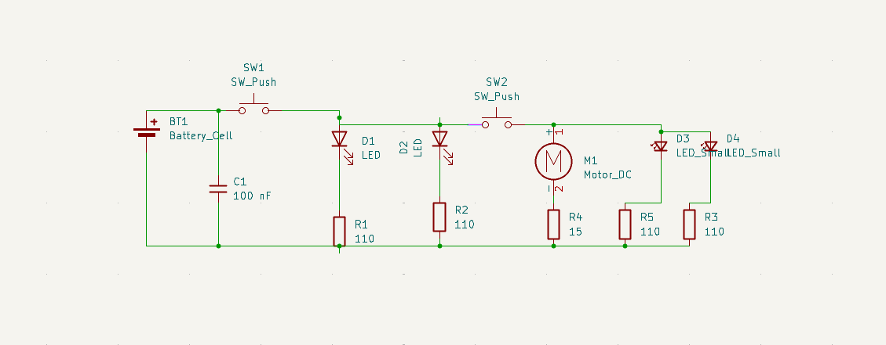
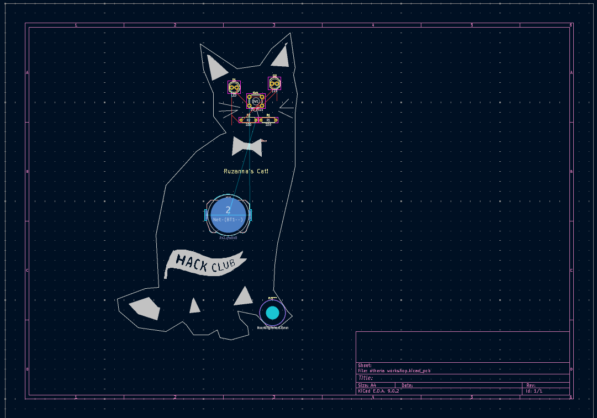
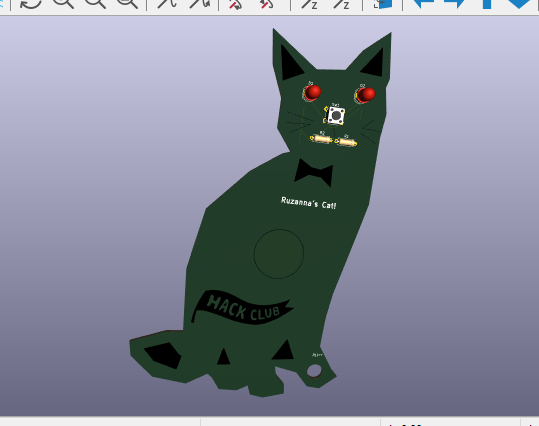

# Ruzanna's Cat PCB 

---
## Description

This is a cat shaped PCB Keychain created during the Hack Club Athena Workshop on PCBs. The design has...
- Two red LEDs as eyes
- A pushbutton as a nose
- Silkscreen art (Cat face, hack club flag)
- Cat shaped outline with edge cuts
- One hole for use as a keychain

Designed using **KiCad**
---

## Bill of Materials

| Part Label(s) | Footprint                                              | Quantity | Description   |
|----------------|---------------------------------------------------------|----------|----------------|
| D2, D1         | LED_D5.0mm                                              | 2        | LED            |
| R2, R1         | R_Axial_DIN0207_L6.3mm_D2.5mm_P7.62mm_Horizontal        | 2        | 220 Ω resistor |
| SW1            | SW_PUSH_6mm                                             | 1        | Pushbutton     |
| BT1            | BatteryHolder_Keystone_3034_1x20mm                      | 1        | Battery Cell   |

---

## Screenshots

- Schematic
  

- PCB Layout
  

- 3D View
  

## Slack Username

@Ruzanna

