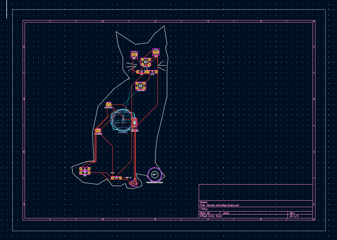
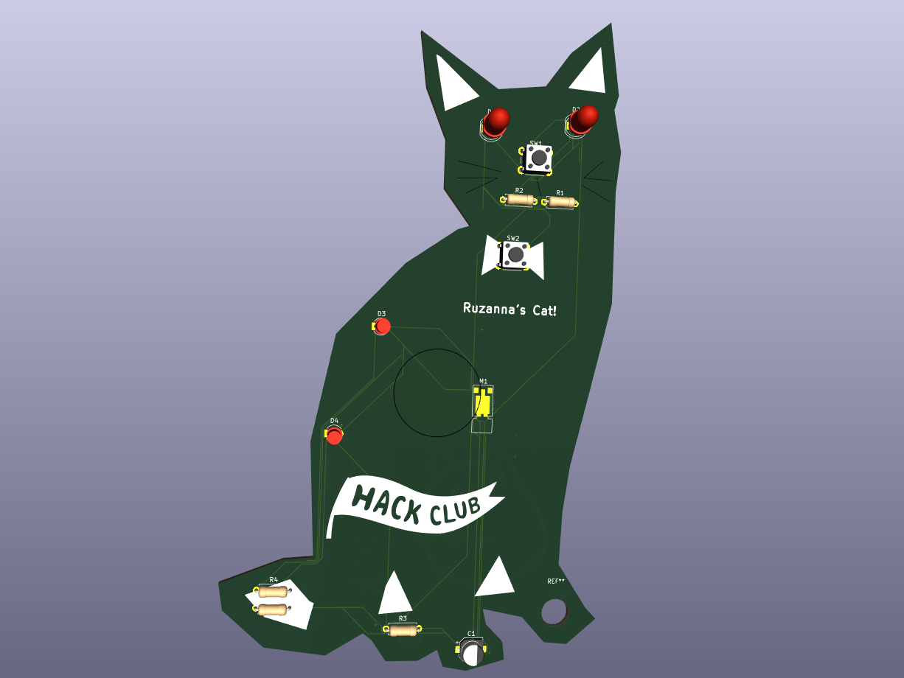
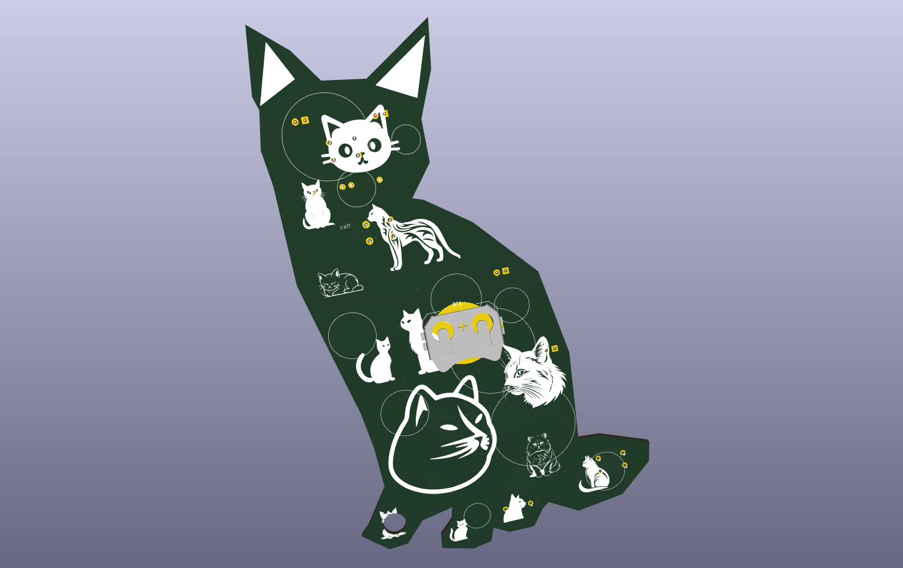

# Ruzanna's Cat PCB 

---
## Description

This is a cat shaped PCB Keychain created during the Hack Club Athena Workshop on PCBs. The design has...
- Two red LEDs as eyes
- Two red LEDs on the body
- A pushbutton as a nose
- A pushbutton as a bow
- Silkscreen art on the front (Cat face, hack club flag)
- Silkscreen art on the back (Cats, circles and text)
- Cat shaped outline with edge cuts
- One hole for use as a keychain
- Vibration motor
- Capacitor for the switch
- Resistors for LEDs and the motor
- Battery

Designed using **KiCad**
---

## Bill of Materials

| Part | Footprint | Quantity | Designation |
|------------|-----------|----------|-------------|
| R3 R5 R2 R1 | R_Axial_DIN0207_L6.3mm_D2.5mm_P7.62mm_Horizontal | 4 | 110 |
| R4 | R_Axial_DIN0207_L6.3mm_D2.5mm_P7.62mm_Horizontal | 1 | 15 |
| M1 | Vybronics_VZ30C1T8219732L | 1 | Motor_DC |
| D3 D4 | LED_D3.0mm_FlatTop | 2 | LED_Small |
| C1 | CP_Elec_5x3.9 | 1 | 100 nF |
| SW2 SW1 | SW_PUSH_6mm | 2 | SW_Push |
| D2 | LED_D5.0mm | 2 | LED |
| BT1 | BatteryHolder_Keystone_3034_1x20mm | 1 | Battery_Cell |

---

## Screenshots

- Schematic
  

- PCB Layout
  

- 3D View
  

## Slack Username

@Ruzanna

